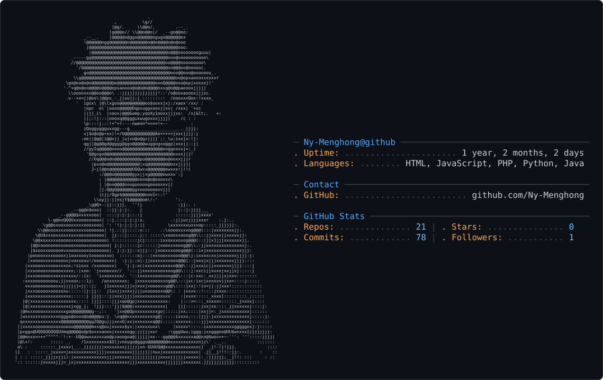

<picture>
  <source media="(prefers-color-scheme: dark)" srcset="dark_mode.svg" />
  <source media="(prefers-color-scheme: light)" srcset="light_mode.svg" />
  
</picture>
    <svg width="500" height="400">
        <rect x="20" y="20" width="120" height="60" fill="skyblue" stroke="black" stroke-width="2"/>
        <circle cx="250" cy="50" r="40" fill="tomato" stroke="black" stroke-width="2"/>
        <ellipse cx="400" cy="50" rx="60" ry="30" fill="lightgreen" stroke="black" stroke-width="2" />
        <line x1="20" y1="120" x2="480" y2="120" stroke="purple" stroke-width="4" />
        <polygon points="80,200 20,300 140,300" fill="gold" stroke="black" stroke-width="2" />
        <polyline points="200,200 250,250 300,200 350,250 400,200" fill="none" stroke="blue" stroke-width="3"/>
        <path d="M 50 350 C 150 250, 350 450, 450 350" fill="none" stroke="red" stroke-width="3" />
        <text x="50" y="380" font-size="20" fill="black">
            SVG is <tspan class="highlight">Powerful</tspan> & Scalable
        </text>

    </svg>
<div align="center">

<!-- ━━━━━━━━━━━━━━━━━━━━━━━━━━━━━━━━━━━━━━━━━━━━━━━━━━━━━━━━━━━━━━━━━━━━━━━━━━━━━━━━━━ -->

<a href="https://git.io/typing-svg">

</a>

<br/>


</div>

<br/>

<!-- ━━━━━━━━━━━━━━━━━━━━━━━━━━━━━━━━━━ NARUTO HERO SECTION ━━━━━━━━━━━━━━━━━━━━━━━━━━━━━━━━━━ -->

<table>
<tr>
<td width="40%" align="center">


</td>
<td width="60%">
 About Me

I'm a **Web Developer** from Cambodia who loves building things for the web and watching anime.

<br/>

```yaml
name: Ny-Menghong
location: Cambodia
education: Self-taught Developer
current_learning: Vue.js, Node.js
languages: HTML, CSS, JavaScript
tools: Git, GitHub, VS Code
goals: Build amazing web projects
hobbies: Anime, Gaming, Coding
```

<br/>

<a href="https://github.com/Ny-Menghong">

</a>
<a href="https://github.com/Ny-Menghong?tab=repositories">

</a>

</td>
</tr>
</table>

<br/>

<!-- ━━━━━━━━━━━━━━━━━━━━━━━━━━━━━━━━━━ DIVIDER ━━━━━━━━━━━━━━━━━━━━━━━━━━━━━━━━━━ -->


</div>
